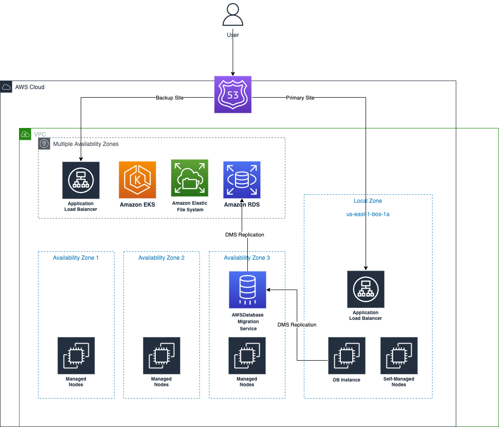

### EKS running on Local Zone demo 

This project contains Terraform infrastructure as code for deploying a sample, highly resilient, multi-region application running on Amazon EKS and other AWS services. 

It contains the companion source code for the [Workload on EKS in Local Zones with resilient architecture]().  The IaC code is written in Terraform.

Our goal is to provide an example - WordPress application in the post, of running your workload in the local zone on Amazon EKS, and failover to the region in the rare event of an issue in the local zone.

## Architecture 



In the example app, I am going to run a WordPress website as the demo app to run on Amazon EKS. 

The customer facing endpoint is a Route 53 domain (demo.lindarren.com (http://demo.lindarren.com/)) and has a failover policy to the primary site in the local zone (demo.primary.lindarren.com (http://demo.primary.lindarren.com/)) and backup site (demo.backup.lindarren.com (http://demo.backup.lindarren.com/)) in the availability zones in the region. 

When the customer is connecting to the primary site (local zone), the request is served by the application load balancer (ALB) in the local zone, and the backend servers are hosted by Kubernetes pods, running on the self-managed EC2 nodes. The backend database is an EC2 instance with MariaDB installed. 

For the backup site, there is an also an application load balancer (ALB) and Kubernetes pods running on worker nodes in the region. The database is hosted on RDS. We use DMS to replicate data from the EC2 database instance in the local zone to RDS in the region. 

For persistent storage, the PHP application files are stored on the EFS. It is not supported to create EFS targets in the local zone subnets, so I made a few tweaks to make EFS CSI driver DaemonSet in the local zone to mount EFS filesystem for the pod. 


## Prerequisites: 

* An AWS account with the Administrator permissions 
* Installation of AWS CLI (https://docs.aws.amazon.com/cli/latest/userguide/getting-started-install.html), kubectl (https://docs.aws.amazon.com/eks/latest/userguide/install-kubectl.html), eksctl (https://docs.aws.amazon.com/eks/latest/userguide/getting-started-eksctl.html), Git (https://git-scm.com/book/en/v2/Getting-Started-Installing-Git), Terraform (https://learn.hashicorp.com/tutorials/terraform/install-cli), jq (https://stedolan.github.io/jq/).
* A domain name that you own, for example, lindarren.com
* A shell environment. An IDE environment such as Cloud9 or Visual Studio Code is recommended. Please make sure that you configured IAM credentials on your own instead of Cloud9’s temporary credentials.  
* Opt-in Local Zone that you would like to run your workload
* An TLS certificate for web hosting as a resource in AWS ACM. 


Now clone the source code to your working directory and configure a few aliases. 

```
[git clone https://github.com/aws-samples/eks-localzone-demo.git](https://github.com/aws-samples/eks-localzone-demo)
# A few optional shorthands
alias tf=terraform
alias k=kubectl 
```

### Step 1. Deploy VPC

The first thing we'll need to provision for this architecture is a VPC, containing both local zone and availability zones for the EKS cluster and database instances; Actually, there will be 3 public and 3 private subnets in the availability zones, and 1 private and 1 public subnet in the local zone. 

In the `main.tf`, we use `vpc` module to create the subnets in the availability zones. For local zone subnets, we create  `aws_subnet` terraform resources.  

```
...

resource "aws_subnet" "public-subnet-lz" {
  vpc_id                  = module.vpc.vpc_id
  availability_zone       = local.lzs[0]
  ...
}

resource "aws_subnet" "private-subnet-lz" {
  ...
}

resource "aws_route_table_association" "public-subnet-lz-rta" {
  subnet_id      = aws_subnet.public-subnet-lz.id
  route_table_id = module.vpc.public_route_table_ids[0]
}

resource "aws_route_table_association" "private-subnet-lz-rta" {
  subnet_id      = aws_subnet.private-subnet-lz.id
  route_table_id = module.vpc.private_route_table_ids[0]
}
```

To create the VPC, let’s review and define the input variables. The VPC is in `us-east-1` and the local zone `us-east-1-bos-1a` , and provide a `name` and `vpc_cidr` for the VPC.   

```
cd deploy/01-vpc
vim demo.auto.tfvars
```

```
name         = "demo-vpc" 
vpc_cidr     = "10.0.0.0/16"
cluster_name = "lindarr-demo" # Name of EKS Cluster, for subnet tagging 
region       = "us-east-1"
lzs          = ["us-east-1-bos-1a"]
```

Deploy the VPC infrastructure using `terraform` CLI.  

```
terraform init 
terraform apply -auto-approve
```

In the output, or run `terraform output` to get the VPC ID and subnets IDs, including the subnets in the availability zones, and the subnets in the local zone. For deploying additional resources like RDS, EKS, and EC2 in the upcoming steps, you can use the subnet IDs from the output here. 

```
➜  01-vpc git:(main) ✗ terraform output
private_subnets = [
  "subnet-04bfbdb56eab20f3f",
  "subnet-0282d89055cab1760",
  "subnet-0e3d213bfb21127fa",
]
private_subnets_local_zone = "subnet-0179a7e06585a551f"
public_subnets = [
  "subnet-0d05de32e811f03c4",
  "subnet-0c2d26c64af1f9889",
  "subnet-0e5495f6c4218f5aa",
]
public_subnets_local_zone = "subnet-0b49a2a528a2d2e68"
vpc_id = "vpc-0c544fbcafdbbb035"
vpc_id_cidr = "10.0.0.0/16"
```

### Step 2. Deploy EKS Cluster 

Next, we are going to use [EKS Blueprint](https://github.com/aws-ia/terraform-aws-eks-blueprints) to create an EKS Cluster, including the Kubernetes Control Plane, a managed node group in availability zone, and a self-managed node group in the Local Zone.

Change the working directory to `02-eks` and edit the variables. 

```
cd ../02-eks
vim demo.auto.tfvars
```

Modify the variables, mainly the resource IDs of VPC and subnets (by copying the partial output from the first module)

```
vpc_id = "vpc-0c544fbcafdbbb035"
private_subnets = [
  "subnet-04bfbdb56eab20f3f",
  "subnet-0282d89055cab1760",
  "subnet-0e3d213bfb21127fa",
]
private_subnets_local_zone   = "subnet-0179a7e06585a551f"
cluster_name                 = "my-eks-demo-cluster"
domain_name_in_route53 = "lindarren.com"
```

In the `main.tf`, we use the module [EKS Blueprints for Terraform](https://github.com/aws-ia/terraform-aws-eks-blueprints) to create the EKS cluster. It will make creating an EKS cluster easier, especially for creating self-managed node groups in local zone subnets. Also note, in the local zone, instance types is limited and the EBS volume type is limited to `gp2.`  

In addition, In the EKS Blueprint module for terraform, security group rules of self-managed nodes are restrictive, so we added additional rules so that self-managed nodes and managed nodes can communicate without issues. These additional rules are required for mixed managed node group and self-managed node group workloads to avoid [CoreDNS queries being blocked by security group rules](https://github.com/aws-ia/terraform-aws-eks-blueprints/issues/619). 

Below are some code snippet in the `main.tf` :

```
...

  # EKS Self-Managed Node Group in Local Zone
  self_managed_node_groups = {
    self_mg_4 = {
      node_group_name    = "self-managed-ondemand"
      instance_type      = "t3.xlarge" # instance types are limited in the local zone
      launch_template_os = "amazonlinux2eks" # or bottlerocket 
      block_device_mappings = [
        {
          device_name = "/dev/xvda"
          volume_type = "gp2" # Local Zone supports gp2 volumes only 
          volume_size = "100"
        },
      ]
      subnet_ids = [var.local_zone_private_subnet_id]
    },
  }

...
  # https://github.com/aws-ia/terraform-aws-eks-blueprints/issues/619
  # Allow Connection from other nodes 
  node_security_group_additional_rules = {
    egress_all = {
      description      = "Node all egress"
      ...
    }
  }
...


```

```

resource "aws_security_group_rule" "allow_node_sg_to_cluster_sg" {
  # Self-managed Nodegroup to Cluster API/Managed Nodegroup all traffic
  source_security_group_id = module.eks_blueprints.worker_node_security_group_id
  security_group_id        = module.eks_blueprints.cluster_primary_security_group_id
  ...
 }

resource "aws_security_group_rule" "allow_node_sg_from_cluster_sg" {
  # Cluster API/Managed Nodegroup to Self-Managed Nodegroup all traffic
  source_security_group_id = module.eks_blueprints.cluster_primary_security_group_id
  security_group_id        = module.eks_blueprints.worker_node_security_group_id
  ...
 }
```


In the `eks_blueprints_kubernetes_addons` module you can enable several add-ons directly, and the module will create both IAM Role for Service Account and install the helm chart. For example, I will use EFS CSI driver, AWS Load Balancer Controller, external DNS, etc., so I set the respective keys and their values to be `true.T`hese add-ons will deployed by the Terrafrom module after EKS cluster creation.  

```
module "eks_blueprints_kubernetes_addons" {
  ...
  enable_amazon_eks_aws_ebs_csi_driver = true
  enable_aws_load_balancer_controller = true
  enable_metrics_server               = true
  enable_external_dns       = true
  ...
}
```

Now let’s move forward and create the EKS Cluster by running `terraform`.  The EKS cluster, node group creation, and add-on installation will take approximately 20 minutes to complete.  

```
terraform init
terraform plan 
terraform apply -auto-approve
```

After the command completed, the EKS cluster and nodes on the local zone and add-ons have been deployed. By running `kubectl get node` you will be able to find node(s) in `us-east-1-bos-1a` zone, and running `kubectl get pod`  you can find `aws-load-balancer-controller `and` external-dns `pods are running and ready.` `

```
➜  ~ aws eks update-kubeconfig \
--name $(tf output eks_cluster_id | jq . -r) \
--region us-east-1 
Updated context arn:aws:eks:us-east-1:091550601287:cluster/lindarr-demo in /Users/lindarr/.kube/config

# Some node(s) are running in local zone
➜  ~ kubectl get node --label-columns failure-domain.beta.kubernetes.io/zone
NAME                          STATUS   ROLES    AGE     VERSION               ZONE
ip-10-0-11-232.ec2.internal   Ready    <none>   14d     v1.22.6-eks-7d68063   us-east-1b
ip-10-0-15-39.ec2.internal    Ready    <none>   3d17h   v1.22.6-eks-7d68063   us-east-1-bos-1a
...

# AWS LB Controller and External DNS are running 
➜  ~ kubectl get pod -n kube-system
NAME                                                         READY   STATUS      RESTARTS   AGE
aws-load-balancer-controller-75bd4dfcbd-bwdqt                1/1     Running     0          11d
aws-load-balancer-controller-75bd4dfcbd-kx8l5                1/1     Running     0          3d16h
aws-node-bxzkb                                               1/1     Running     0          11d
aws-node-p8bm7                                               1/1     Running     0          3d16h
coredns-7f5998f4c-886lb                                      1/1     Running     0          11d
coredns-7f5998f4c-cv5b8                                      1/1     Running     0          3d16h
ebs-csi-controller-588dffc699-vh8gb                          5/5     Running     0          3d16h
ebs-csi-controller-588dffc699-zkxxh                          5/5     Running     0          3d16h
ebs-csi-node-898nj                                           3/3     Running     0          11d
ebs-csi-node-b4b5r                                           3/3     Running     0          3d16h
efs-csi-controller-9d944546-9s6cz                            3/3     Running     0          11d
efs-csi-controller-9d944546-gtmc9                            3/3     Running     0          3d16h
efs-csi-node-7klzk                                           3/3     Running     0          8d
efs-csi-node-wzwlc                                           3/3     Running     0          3d16h
kube-proxy-n6s4q                                             1/1     Running     0          14d
kube-proxy-vhdrx                                             1/1     Running     0          3d16h
metrics-server-694d47d564-zxfrs 

# External DNS is running 
➜  ~ kubectl get po -n external-dns 
NAME                           READY   STATUS    RESTARTS   AGE
external-dns-96c667c79-88zcv   1/1     Running   0          25d
                      
```

### Step 3. Deploy EFS filesystems and targets 

In the following sections, we are going to deploy the necessary AWS resources for WordPress - our demo application. If you are going to deploy your own application and would like to know some caveats related to EKS in the local zone (especially for ALB Ingress), you can fast forward to the Step 6 directly.

WordPress on Kubernetes requires a persistent volume to store the application and data. EFS is chosen for this demo, as we require the storage that can be accessed from the local zone and availability zone. On the other hand, if your application accesses the PV frequently and requires low latency, consider EBS for the Persistent Volume, and you need to have other mechanism to replicate or backup data on EBS volumes from local zone to the available zones. 

Now let’s create EFS resources using Terraform, and get the EFS filesystem and access point IDs for the volumeHandle of PV.   

```
cd ../03-efs
vim demo.auto.tfvars # Edit the VPC and subnet IDs

tf init 
tf plan 
tf apply -auto-approve
```

```
➜  03-efs git:(main) ✗ terraform output
efs_ap_id    = "fsap-03b76858b781b84ff"
efs_id       = "fs-08312777c25f61ee9"
volumeHandle = "fs-08312777c25f61ee9::fsap-03b76858b781b84ff"
```

Since in the local zone, EFS mount targets are not supported, we make some [tweaks](https://github.com/kubernetes-sigs/aws-efs-csi-driver/issues/240#issuecomment-676849346) on the EFS CSI driver so that EFS mount points (in the region) can be resolved in the local zone worker nodes without errors. Use `kubectl` to patch the EFS CSI manifests and add `hostAliases` for the EFS mount points.

```
➜  03-efs git:(main) ✗ terraform output
efs_ap_id = "fsap-046d60b356c84b394"
efs_id = "fs-024f950b4c448cc67"
efs_mount_target = [
  "10.0.10.87",
  "10.0.11.151",
  "10.0.12.41",
]
volumeHandle = "fs-024f950b4c448cc67::fsap-046d60b356c84b394"


➜  ~ vim efs-node-patch.yaml

spec:
  template:
    spec:
      # Add host Aliases here so that EFS mount points can be resolved on Local Zones
      # Otherwise, DNS resolution will fail if the CoreDNS pod is running on local zone
      # Or fail randomly, if one coredns pod is on AZ and another pod is on Local Zone 
      hostAliases:
      - hostnames:
        - fs-08312777c25f61ee9.efs.us-east-1.amazonaws.com
        ip: 10.0.10.26
      - hostnames:
        - fs-08312777c25f61ee9.efs.us-east-1.amazonaws.com
        ip: 10.0.12.4
      - hostnames:
        - fs-08312777c25f61ee9.efs.us-east-1.amazonaws.com
        ip: 10.0.11.140

```


```
➜  03-efs git:(main) ✗ kubectl patch daemonset -n kube-system efs-csi-node --patch-file efs-node-patch.yaml
Warning: spec.template.spec.nodeSelector[beta.kubernetes.io/os]: deprecated since v1.14; use "kubernetes.io/os" instead
daemonset.apps/efs-csi-node patched
```

### Step 4. Deploy EC2 Database Instances, RDS and DMS  

For the database tier, we run MariaDB on EC2 in Local Zone as the primary site, RDS in the the region, and use DMS to replicate the tables and records from EC2 instance to RDS.  We create the resources using the Terraform module located in `04-database` directory. 

If you haven’t created required DMS role before, please specify the `create_iam_roles = true`  in the `demo.auto.tfvars` file. If you don’t have an SSH key pair, please refer to the [docs](https://docs.aws.amazon.com/AWSEC2/latest/UserGuide/create-key-pairs.html) to create one and replace the key name `my_ssh_key_name` in the `.tfvars` file. 

```
cd ../04-database
vim demo.auto.tfvars # Edit the VPC and subnet IDs
```

```
private_subnets = [
  "subnet-01f9037408ae338ad",
  "subnet-0f30e01d3f9addd62",
  "subnet-0096b2f4142dbdae2",
]
private_subnets_local_zone = "subnet-0f19d51410f6167ac"

ssh_key_name   = "my_ssh_key_name" # Relace the ssh_key_name to your SSH ke 
vpc_cidr_block = "10.0.0.0/16"

vpc_id = "vpc-0a65e88418d47f0ee"
 
create_iam_roles = true # set to true if IAM role required are not created before
```

```
terraform init 
terraform plan 
terraform apply -auto-approve

...

➜  04-database git:(main) ✗ tf output
db_ec2_instance_id = "i-019b9172637105e4e"
db_ec2_instance_ip = "10.0.15.200"
ec2_mariadb_password = <sensitive>
rds_endpoint = "demo-test-mariadb-instance.cdyids0dslnl.us-east-1.rds.amazonaws.com:3306"
rds_password = <sensitive>

➜  04-database git:(main) ✗ terraform output rds_password
"bbFVta-ExampleRDSPassword"

```

You can use SSH into the DB instance via a bastion host (details can be found in this [blog](https://aws.amazon.com/blogs/infrastructure-and-automation/deploy-bastion-hosts-into-private-subnets-with-aws-cdk/)), or use SSM to login the instance and configure the database.  Please ensure that you have installed [Session Manager plugin](https://docs.aws.amazon.com/systems-manager/latest/userguide/session-manager-working-with-install-plugin.html#install-plugin-linux) mentioned in the docs. 

```
➜  04-database git:(main) aws ssm start-session \
  --region us-east-1 \
  --target $(tf output db_ec2_instance_id | jq . -r)
   
```

After successfully starting the MariaDB server, we run the scripts below to create `wordpress` database and `wordpress` user for WordPress blog data. Also, grant the necessary privileges for replication. Replace `wordpress99` for the user database password. 

```
bash 

sudo mysql -sfu root -e "GRANT ALL PRIVILEGES ON wordpress.* to 'wordpress'@'%' IDENTIFIED BY 'wordpress99';"
sudo mysql -sfu root -e "GRANT SUPER, RELOAD, PROCESS, REPLICATION SLAVE, REPLICATION CLIENT ON *.* TO wordpress@'%';"
sudo mysql -sfu root -e "FLUSH PRIVILEGES;"

sudo systemctl stop mariadb
```

Next, we will use DMS to replicate data changes from MariaDB on EC2 at later stage, so we need to enable and configure `bin-log` for replication. Here is the modification for MariaDB on EC2.

```
sudo tee /etc/my.cnf.d/server.cnf<<EOT
[mysqld]
log_bin=/var/lib/mysql/bin-log
log_bin_index=/var/lib/mysql/mysql-bin.index
expire_logs_days= 2
binlog_format= ROW
EOT

sudo systemctl start mariadb

# Ctrl^D twice to exit the shell and session 
```

In order to achieve high-availability for the database tier, we create an RDS of MariaDB in region as stand-by replica and use AWS DMS to replicate data between MariaDB on EC2 and RDS for MariaDB.

In the terraform module, we will create the required AWS resources, including IAM roles, DMS instance, source and target endpoints, as well as the DMS Replication task and use “Full load + CDC” to copy all data from MariaDB on EC2 and continuously replicate data changes to RDS for MariaDB. 

With the below snippet of the of table-mappings JSON file, DMS will replicate all tables in w`ordpress` database from MariaDB on EC2.

```
# table-mappings.json
{
    "rules": [
        {
            "rule-type": "selection",
            "rule-id": "1",
            "rule-name": "1",
            "object-locator": {
                "schema-name": "wordpress",
                "table-name": "%"
            },
            "rule-action": "include"
        }
    ]
}
```

### Step 5. Deploy Route 53

We are going to deploy Route 53 records and[Health Checks](https://docs.aws.amazon.com/Route53/latest/DeveloperGuide/dns-failover.html) for both ALB in the local zone and availability zone with CNAME records. 
  
The domain `demo.primary.lindarren.com`  is used for the ALB in the local zone, and will be registered by the `external-dns` controller that we installed in the EKS Blueprint module. Similarly, the domain  `demo.backup.lindarren.com` will be used for the ALB in the region. 

The heath checks will perform on both sites. When the primary site (local zone) is healthy, the DNS record `demo.lindarren.com` will be resolved to `demo.primary.lindarren.com. `On the other hand, when the primary site (local zone) does not return successful results, the DNS record `demo.lindarren.com` will be resolved to `demo.backup.lindarren.com`. 

Here's code snippet of how we setup our Health Check and Failover Policy using Terraform.

```
resource "aws_route53_health_check" "localzone" {
  fqdn              = local.endpoint_local_zone
  resource_path     = "/"
  type              = "HTTPS"
  port              = 443
  failure_threshold = 5
  request_interval  = 30
  tags = {
    Name = "Health Check for Ingress in Local Zone"
  }
}

...

resource "aws_route53_record" "localzone" {
  zone_id         = data.aws_route53_zone.main.zone_id
  name            = "${local.app_name}.${local.domain_name}"
  records         = [local.endpoint_local_zone]
  set_identifier  = "primary"
  type            = "CNAME"
  ttl             = 60
  health_check_id = aws_route53_health_check.localzone.id
  failover_routing_policy {
    type = "PRIMARY"
  }
}
```


You can edit the `main.tf` , modify the local variables and run `terraform apply` to deploy the Route 53 resources.  

```
cd ../05-route53
vim demo.auto.tfvars 
```

```
endpoint_local_zone = "demo.primary.lindarren.com"
endpoint_region     = "demo.backup.lindarren.com"
domain_name    = "lindarren.com."
app_name       = "demo"
```

```
terraform init 
terraform apply -auto-approve
```

### Step 6. Deploy Kubernetes Application

After AWS resources are created, we are going to deploy the Kubernetes resources for our application. 

We will have two deployments for WordPress app. One is in the local zone, with `nodeAffinity`  requires `topology.kubernetes.io/zone` in the local zone `us-east-1-bos-1`. Another deployment has `NotIn` operator, so that the pods will be launched in the region. Modify the value of variable `WORDPRESS_DB_HOST` to be the private IP of your DB instance in the output of step 4. 


```
cd ../06-kubernetes
vim wordpress-deployment.yaml
```

```
kind: Deployment
apiVersion: apps/v1
metadata:
  name: wordpress
  ...
spec:
  ...
    spec:
      affinity:
        nodeAffinity:
          requiredDuringSchedulingIgnoredDuringExecution:
            nodeSelectorTerms:
            - matchExpressions:
              - key: topology.kubernetes.io/zone
                operator: In
                values: # Modify the value to the local zone of yours 
                - us-east-1-bos-1 
      containers:
      - image: wordpress:php7.1-apache
        name: wordpress
        env:
        - name: WORDPRESS_DB_HOST # REPLACE IT WITH THE PRIVATE IP OF DB INSTANCE
          value: "10.0.15.185"
```

For the shared storage, enter the volumeHandle with the EFS ID and EFS AccessPoint ID, in the output of step 3. 


```
# Editing wordpress-deployment.yaml
apiVersion: v1
kind: PersistentVolume
metadata:
  name: wordpress-efs-pv
spec:
...
  csi:
    driver: efs.csi.aws.com 
    volumeHandle: "fs-08312777c25f61ee9::fsap-0250aa2272226c8d4"
```

For the ingress in the local zone, we define the value of `alb.ingress.kubernetes.io/subnets` to be the **public** subnet ID in the local zone, in the `terraform output` of step 1. For the ingress in the region, we let AWS Load Balancer Controller to discover public subnets using tags. Configure annotation `external-dns.alpha.kubernetes.io/hostname` to allow External DNS Controller to register ALB to Route 53 automatically. We use ACM certificate and bind it to the Application Load Balancer for HTTPS listener. If you haven’t an existing ACM certificate, please refer to the [AWS ACM Docs - Request a public certificate using the console](https://docs.aws.amazon.com/acm/latest/userguide/gs-acm-request-public.html#request-public-console)
 here. 

```
# Editing wordpress-deployment.yaml
 
apiVersion: networking.k8s.io/v1
kind: Ingress
metadata:
  name: wordpress-ingress
  annotations:
    # public subnet in local zone 
    alb.ingress.kubernetes.io/subnets: "subnet-0b49a2a528a2d2e68"
    alb.ingress.kubernetes.io/scheme: internet-facing
    # provide the AWS ACM Certificate ARN
    alb.ingress.kubernetes.io/certificate-arn: arn:aws:acm:us-east-1:091550601287:certificate/75cad826-f2f2-45e5-8bfe-c9b722d635d7
    # provide the domain name
    external-dns.alpha.kubernetes.io/hostname: demo.primary.lindarren.com

...
```


For the deployment in the region, also configure the `DB_HOST` environment variable to use the DB Instance in the Local Zone. We would like to make sure only one database (DB Instance in the local zone currently) is writable and RDS endpoint will be connected after failover. 


```
vim wordpress-backup.yaml
```


```
apiVersion: apps/v1 
kind: Deployment
metadata:
  name: wordpress-region
  labels:
    app: wordpress-region
spec:
  ...
      containers:
      - image: wordpress:php7.1-apache
        name: wordpress
        env:
        - name: WORDPRESS_DB_HOST
          value: "10.0.15.185"
```

For the Ingress to register a Route 53 record in the hosted zone and attach an ACM certificate. 

```
# wordpress-backup.yaml
apiVersion: networking.k8s.io/v1
kind: Ingress
metadata:
  name: wordpress-ingress-backup
  annotations:
    # provide the external domain name 
    external-dns.alpha.kubernetes.io/hostname: demo.backup.lindarren.com
    alb.ingress.kubernetes.io/scheme: internet-facing
    # provide the AWS ACM Certificate ARN 
    alb.ingress.kubernetes.io/certificate-arn: arn:aws:acm:us-east-1:091550601287:certificate/75cad826-f2f2-45e5-8bfe-c9b722d635d7
```

Define the secret values of RDS password and DB Instance user password in the `kustomization.yaml` 

```
secretGenerator:
- name: db-instance-pass
  literals:
  - password=wordpress99 
- name: rds-pass
  literals:
  - password=bbFVta-RDSExamplePassword # Replace with RDS Password in Terraform output
- name: mysql-pass
  literals:
  - password=rae2ooQu6uj6AiQu5mie0die4thuZu # This is for the mysql stateful, but not used currently 
resources:
  - wordpress-deployment.yaml  
  - wordpress-backup.yaml  
  - mysql-deployment.yaml  
```

Deploy the Kubernetes resources by running `kubectl`  

```
➜  06-kubernetes git:(main) ✗ kubectl apply -k . 
```

After the resources are created, open the web browser to open WordPress website, and start the initial setup. After the setup is completed, go to https://demo.lindarren.com/ to ensure the WordPress is running. 
[Image: Screen Shot 2022-06-15 at 4.57.54 PM.png]Once completion, After the installation are completed, the final step is starting the DMS replication task. Go to DMS console,  find Endpoints > source connections, and run test if it failed before. 
[Image: image.png]Use the commands below (or use the AWS DMS Console) to start/resume the replication.  

```

cd ../04-database 

DMS_REPL_TASK_ARN=$(tf output dms_repication_task_arn | jq . -r)

aws dms start-replication-task \
    --replication-task-arn $DMS_REPL_TASK_ARN \
    --start-replication-task-type start-replication \
    --region us-east-1
    
{
    "ReplicationTask": {
        "ReplicationTaskIdentifier": "demo-localzone-replication-task",
        "SourceEndpointArn": "arn:aws:dms:us-east-1:091550601287:endpoint:WPOUJ3ON74LXPHYKE4DOFIYXDAZFMSNKI3Z3S3Q",
        "TargetEndpointArn": "arn:aws:dms:us-east-1:091550601287:endpoint:YYYCLSMAYTHHLPXTINE3IM4AL4OOJRFBEZEZNKI",
        "ReplicationInstanceArn": "arn:aws:dms:us-east-1:091550601287:rep:RCISNMDF3F7VM5IVMSRVCPFXBRYLUHCXP2BC5SQ",
        "MigrationType": "full-load-and-cdc",
        "TableMappings": "{\n    \"rules\": [\n        {\n            \"rule-type\": \"selection\",\n            \"rule-id\": \"1\",\n            \"rule-name\": \"1\",\n            \"object-locator\": {\n                \"schema-name\": \"wordpress\",\n                \"table-name\": \"%\"\n            },\n            \"rule-action\": \"include\"\n        }\n    ]\n}",
        "ReplicationTaskSettings": "......",
        "Status": "starting",
        "ReplicationTaskCreationDate": "2022-07-22T15:16:56.808000+08:00",
        "ReplicationTaskStartDate": "2022-07-22T15:55:04.720000+08:00",
        "ReplicationTaskArn": "arn:aws:dms:us-east-1:091550601287:task:YDR7LINDFJVSVKNB7IMGKKXFRJBWWOZFMBOGICQ"
    }
}
```

Check the AWS DMS console and find the tables are being replicated from MariaDB Instance to RDS. 
[Image: Screen Shot 2022-06-15 at 5.05.46 PM.png]Check the Route 53 Console, the health checks shows that both primary site and backup site are healthy.  The domain is now resolved to Load Balancer in the local zone. You can use `dig` commands to verify the DNS resolution.  
[Image: Screen Shot 2022-06-15 at 5.06.14 PM.png]
```
➜  ~ kubectl get ingress
NAME                       CLASS   HOSTS   ADDRESS                                                                  PORTS   AGE
wordpress-ingress          alb     *       k8s-default-wordpres-ed46143e74-1394360021.us-east-1.elb.amazonaws.com   80      12d
wordpress-ingress-backup   alb     *       k8s-default-wordpres-8d75cd8cec-1858496555.us-east-1.elb.amazonaws.com   80      9d

➜  ~ dig k8s-default-wordpres-ed46143e74-1394360021.us-east-1.elb.amazonaws.com +short
68.66.115.193
68.66.113.46

➜  ~ dig demo.lindarren.com +short
demo.primary.lindarren.com.
68.66.113.46
68.66.115.193
```

### Step 7. Failover Test from Local Zone to Region 

Now we are going to simulate some failure on the pods in the local zone, and failover to the backup site in the region. Run the commands below to disrupt the Kubernetes deployment in the local zone. 

```
# Scale the Pod Replica to 0 and terminate DB Instance
kubectl scale --replicas=0 deploy/wordpress
```

Wait for a few minutes, and you can find the Route 53 health checks saying that the primary site is unhealthy. 
[Image: Screen Shot 2022-06-15 at 5.08.58 PM.png]Now run `dig` to resolve the domain, and we are still able to open the WordPress website since the Application Load Balancer, EC2 worker nodes, (not including database at the moment) tier are directed to the resources in the availability zone when the local zone is not healthy.  

```
➜  ~ dig demo.lindarren.com +short 
demo.backup.lindarren.com.
35.170.24.26
54.157.147.250
3.226.144.41
```

In the blog post, database failover is performed at the application level, but can be implemented with a Kubernetes service or a custom domain in the future. To switch from DB Instance to RDS, we change the database connection endpoints in the Kubernetes Deployment and restart the deployment. Get the secret name from `kubectl get secret` and put the secret name in the environment variable of the `wordpress-backup` deployment. 

```
➜  06-kubernetes git:(main) ✗ aws ec2 stop-instances --region us-east-1 \
  --instance-ids $(tf -chdir=../04-database output db_ec2_instance_id | jq . -r) 

➜  06-kubernetes git:(main) ✗ kubectl get secret
NAME                          TYPE                                  DATA   AGE
db-instance-pass-95cd7tdbdf   Opaque                                1      2d7h
default-token-b5q6v           kubernetes.io/service-account-token   3      2d8h
mysql-pass-ft5b2tdk5m         Opaque                                1      2d7h
rds-pass-g48k9fdbhc           Opaque   

➜  06-kubernetes git:(main) ✗ kubectl edit deploy/wordpress-region                           
                                                                                       1      2d7h
```

```

# wordpress-backup.yaml
# get the RDS endpoint 
# tf -chdir=../04-database output rds_endpoint, removing port number 
---
apiVersion: apps/v1 
kind: Deployment
metadata:
  name: wordpress-region
  labels:
    app: wordpress-region
spec:
  ...
      containers:
      - image: wordpress:php7.1-apache
        name: wordpress
        env:
        - name: WORDPRESS_DB_USER
          value: "admin"
        - name: WORDPRESS_DB_HOST
          value: "demo-localzone-test-mariadb-instance.cdyids0dslnl.us-east-1.rds.amazonaws.com"
        - name: WORDPRESS_DB_PASSWORD
          valueFrom:
            secretKeyRef:
              name: rds-pass-g48k9fdbhc
              key: password
...
```

After performing the command, you can try to connect to the WordPress website and see the website is still working. 

### Step 8. Destroy All the Resources

After playing with the demo application around, destroy all of the resources using the command below to save costs: 

```
cd ../06-kubernetes
kubectl delete -k . 

cd ../05-route53
terraform destroy -auto-approve

cd ../04-database
terraform destroy -auto-approve

cd ../03-efs
terraform destroy -auto-approve

cd ../02-eks
terraform destroy -auto-approve

cd ../01-vpc
terraform destroy -auto-approve
```

### Summary 

The goal of this post was to show how to architect a highly available and resilient application using EKS on local zone. In the example above, we showed that:

1. Deploy VPC and EKS Cluster in the region and local zone. Define self-managed node groups in the local zone subnet, managed node group in the availability zone subnets, and install add-ons by specifying the respective values being `true` in the EKS Blueprint module.  
2. Deploy a RDS instance and a DB EC2 Instances, and use AWS DMS to replicate the tables and records from local zone to the region. The failover of database is performed by the customer. 
3. Create an EFS filesystem and make tweaks of the EFS CSI driver so that the worker node in the local zone can mount EFS target without errors.  
4. Create Route 53 health checks and records and use failover policy so that the customer is connecting to the local zone as the primary site, and failover to backup site when the primary site is not available.

Hopefully you were able to follow along and are now equipped to build highly resilient applications for your projects on the local zone. For more details, you can find the documentation links below. Happy building!

### Resource Links

* Local Zone
    https://aws.amazon.com/about-aws/global-infrastructure/localzones/
* EKS Blueprint
    https://github.com/aws-ia/terraform-aws-eks-blueprints
* AWS DMS User Guide
    https://docs.aws.amazon.com/dms/index.html

